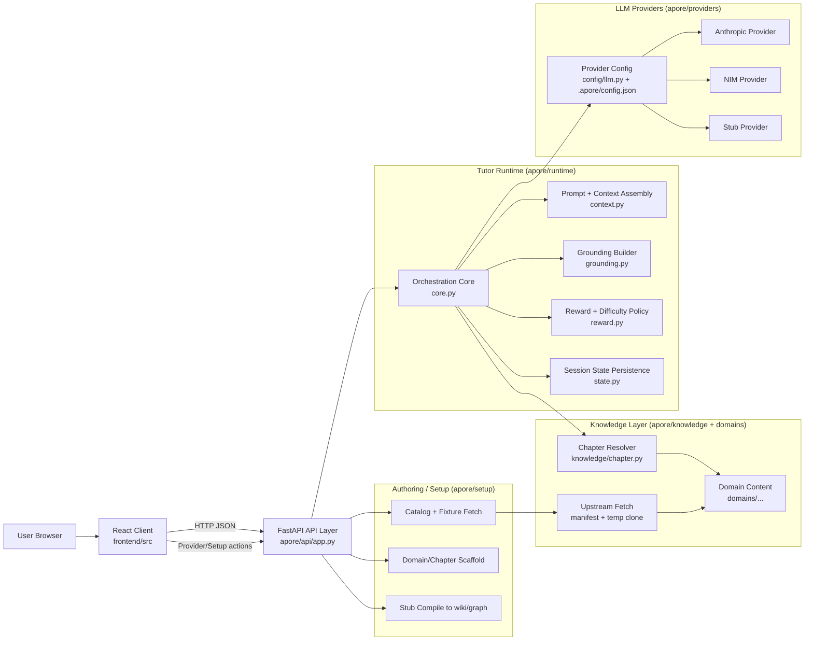

# Architecture

This document explains the high-level architecture of the Apore prototype runtime in `program/`.

## System Overview

## Runtime Boundaries

- **Client (`frontend/src`)**
  - React UI for setup, settings, and the study loop.
  - Calls backend APIs for sessions, questions, turns, and setup/provider operations.

- **API Layer (`apore/api/app.py`)**
  - FastAPI entrypoint and route handlers.
  - Owns HTTP lifecycle and in-process session map.
  - Delegates tutoring behavior to runtime modules.

- **Runtime Core (`apore/runtime`)**
  - `core.py`: orchestrates question generation, grading, and turn finalization.
  - `context.py`: assembles prompt context from system/protocol/grounding/state.
  - `grounding.py`: prepares concept and neighbor grounding text.
  - `reward.py`: computes reward and difficulty update.
  - `state.py`: persists learner state to markdown session files.

- **Knowledge Layer (`apore/knowledge`, `domains/`)**
  - Resolves `knowledge_source` and chapter paths under `domains/`.
  - Loads concept graph and wiki content used for grounding.
  - Upstream templates (e.g. apore-lite) sync into `domains/discrete-math/` via temp git clone.

- **Providers (`apore/providers`, `apore/config/llm.py`)**
  - Configures and selects LLM backend (Anthropic, NIM, or stub).
  - Provides a common invocation surface for runtime calls.

- **Setup/Authoring (`apore/setup`)**
  - Domain/chapter scaffolding.
  - Source upload and stub compile flow.
  - Fixture discovery and fetch support.

## Core Data Flow (Study Loop)

1. **Create Session**  
   `POST /sessions`
   - Resolves knowledge source/chapter.
   - Initializes learner state file under `sessions/`.
   - Registers in-memory `SessionState`.

2. **Generate Question**  
   `POST /sessions/{id}/question`
   - Runtime reads scalar and chapter/concept context.
   - Assembles prompt and invokes configured provider.
   - Returns parsed question payload.

3. **Grade Learner Response (Phase 1)**  
   `POST /sessions/{id}/turn` with `learner_response`
   - Extracts grading signals.
   - Returns `phase="graded"` and stores pending grading.

4. **Finalize Turn (Phase 2)**  
   `POST /sessions/{id}/turn` with `explicit_rating`
   - Computes reward and new scalar.
   - Appends row to session markdown log.
   - Returns `phase="completed"`.

5. **Read State**  
   `GET /sessions/{id}/state`
   - Returns current scalar and session metadata.

## Persistence Model

- **File-backed**
  - `sessions/<session_id>.md` stores scalar and question log history.
  - `.apore/config.json` stores provider settings.
  - Knowledge artifacts live under `domains/...` only.

- **In-memory (process lifetime)**
  - Active and pending session state in the API `sessions` map.

## Design Notes

- Separation is clean between transport concerns (`apore/api`) and tutoring orchestration (`apore/runtime`).
- Provider abstraction allows backend swapping without changing tutoring workflow.
- Setup pipeline is isolated from live tutoring requests.
- The mixed persistence model (file + memory) is simple, but live session state remains process-local.
